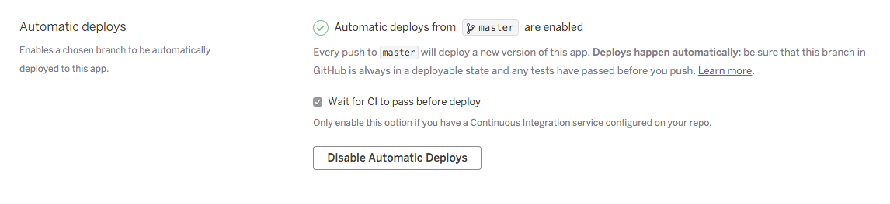

# Content Inventory Automation

App for generating and updating spreadsheets used in making an inventory of govuk documents on a specific subject or subjects.

It runs on heroku at http://inventory-tool.herokuapp.com/

## Technical documentation

This is a Heroku Ruby on Rails application that maintains a database of spreadsheets that the
application has created, and other data.  The app uses GoogleDrive gem to create and
update the spreadsheets.

### Dependencies

* redis
* postgresql

### Developer set up

#### Setting up OAuth for Google's API

If this step is skipped, the sidekiq jobs will make you follow the OAuth process every time
you regenerate an inventory.

1. Go to https://console.developers.google.com and create a project
2. In Google API manager go to Credentials and add OAuth credentials with type "Other"
3. Set environment variables and run the following rake task:
    GOOGLE_CLIENT_ID=... GOOGLE_CLIENT_SECRET=... bundle exec rake google:auth
4. Follow the instructions to get a GOOGLE_REFRESH_TOKEN. Note that this is a non-expiring token that will grant access to anything in your google drive.
5. In API manager, search for Drive API and enable it.

### Running the application

```sh
    redis-server
    GOOGLE_CLIENT_ID=... GOOGLE_CLIENT_SECRET=... GOOGLE_REFRESH_TOKEN=... bundle exec sidekiq
    USERNAME=test PASSWORD=test bundle exec rails s
```

If you are running the app in your development VM, the URL will be http://10.1.1.254:3000/

Enter the username and password that you passed in the environment variables.

### Running the test suite

```sh
bundle exec rake
```

## Deployment

The `master` branch is [automatically deployed](https://devcenter.heroku.com/articles/github-integration#automatic-deploys) to Heroku.



## Licence

[MIT License](LICENCE)


## More information

See the wiki: https://gov-uk.atlassian.net/wiki/pages/viewpage.action?pageId=47677552
